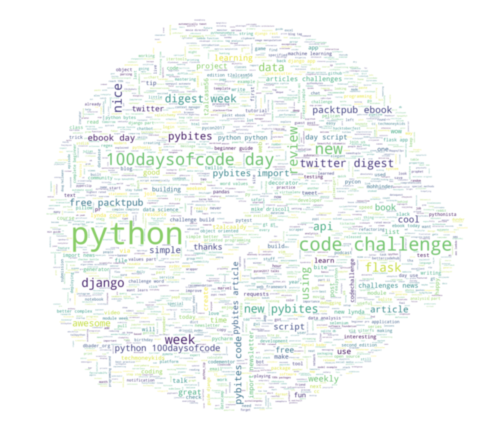

# Twitter Data Analysis with Python

Welcome to this lesson. I prepared [a notebook](https://github.com/talkpython/100daysofcode-with-python-course/blob/master/days/58-60-twitter-api/twitter-api.ipynb) so you can follow along.

## Day 1: Retrieving tweets with Tweepy

First you will set up a [virtual environment](https://pybit.es/the-beauty-of-virtualenv.html), install `tweepy` and set some ENV variables.

Then we will retrieve PyBites tweets which we will put in a [nice wordcloud]() in the shape of [our PyBites logo](https://codechalleng.es/static/img/pybites-premium.png).

Pretty exciting no?

## Day 2 and 3: Practice

We covered Twitter data analysis quite extensively on our blog. See [the notebook](https://github.com/talkpython/100daysofcode-with-python-course/blob/master/days/58-60-twitter-api/twitter-api.ipynb) for a listing of tools and challenges you can work on. As they are not small projects I bundled day 2 and 3 to focus on getting one working.

## Time to share what you've accomplished!

Be sure to share your last couple of days work on Twitter or Facebook. Use the hashtag **#100DaysOfCode**.

Here are [some examples](https://twitter.com/search?q=%23100DaysOfCode) to inspire you. Consider including [@talkpython](https://twitter.com/talkpython) and [@pybites](https://twitter.com/pybites) in your tweets.

See a mistake in these instructions? Please [submit a new issue](https://github.com/talkpython/100daysofcode-with-python-course/issues) or fix it and [submit a PR](https://github.com/talkpython/100daysofcode-with-python-course/pulls).
